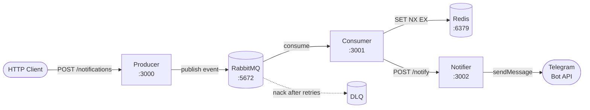

# Notifier Platform

Микросервисная система на NestJS для асинхронной отправки уведомлений в Telegram. Состоит из трёх сервисов, общающихся через RabbitMQ и HTTP. Использует Redis для идемпотентности.

Проект демонстрирует паттерны асинхронной обработки сообщений, надёжной доставки (DLQ, retry, idempotency) и микросервисной архитектуры с принципами SOLID.

## Архитектура



**Producer** принимает HTTP-запросы, валидирует payload через DTO, генерирует UUID для идемпотентности, публикует event в RabbitMQ с метаданными и persistent flag. Возвращает клиенту 202 Accepted.

**Consumer** подписан на очередь `notifications-queue`. Валидирует структуру сообщения, проверяет дубликаты в Redis (атомарный `SET NX EX`), вызывает Notifier по HTTP с экспоненциальным retry. При провале трёх попыток — nack без requeue, сообщение уходит в DLQ.

**Notifier** принимает HTTP-запросы от Consumer'а, отправляет сообщения в Telegram через Bot API. Различает транзиентные и постоянные ошибки Telegram (rate limit, blocked bot, invalid chat).

## Стек

- **Runtime**: Node.js 20+
- **Framework**: NestJS 11
- **Менеджер пакетов**: pnpm
- **Брокер**: RabbitMQ 3.13 (через `@golevelup/nestjs-rabbitmq`)
- **Идемпотентность**: Redis 7
- **HTTP-клиент**: `@nestjs/axios`
- **Логирование**: Pino через `nestjs-pino`
- **Валидация**: class-validator (для HTTP/messages), Joi (для env)
- **Документация API**: Swagger/OpenAPI
- **Тесты**: Jest (unit + e2e)
- **Контейнеризация**: Docker + Docker Compose

## Быстрый запуск через Docker

Самый быстрый способ запустить всё — Docker Compose. Поднимет все пять сервисов (RabbitMQ, Redis, Producer, Consumer, Notifier).

### Требования

- Docker Desktop с Docker Compose V2 (запущен)
- Telegram-бот и chat_id (см. ниже как получить)

### Шаги

```bash

# 1. Клонировать репозиторий

git clone https://github.com/islamicelam/profi-notifier
cd profi-notifier

# 2. Создать .env из шаблона

cp .env.example .env

# 3. Заполнить TELEGRAM_BOT_TOKEN и TELEGRAM_CHAT_ID в .env

# (см. раздел "Настройка Telegram-бота")

# 4. Запустить

docker compose up -d --build

# 5. Проверить статус

docker compose ps
```

Через 30–60 секунд все контейнеры будут `healthy`.

### Тест end-to-end

```bash
curl -X POST http://localhost:3000/notifications \\
-H "Content-Type: application/json" \\
-d '{
"channel": "telegram",
"payload": {
"chatId": "YOUR_CHAT_ID",
"message": "Hello from Notifier Platform!"
}
}'
```

В ответе — `{ "eventId": "..." }`. Через секунду сообщение придёт в Telegram.

## Запуск для разработки (без Docker для приложений)

Удобно при активной разработке — приложения запускаются через `pnpm start:dev` с hot-reload, инфраструктура (RabbitMQ, Redis) — в Docker.

```bash

# Установка зависимостей (требуется pnpm)

pnpm install

# Поднимаем только инфраструктуру

docker compose up -d rabbitmq redis

# В трёх отдельных терминалах:

pnpm start:dev producer
pnpm start:dev consumer
pnpm start:dev notifier
```

### Установка pnpm

Если pnpm ещё не установлен:

```bash

# Через corepack (поставляется с Node.js)

corepack enable
corepack prepare pnpm@latest --activate

# Или через Homebrew (на macOS)

brew install pnpm

# Или через npm

npm install -g pnpm
```

## Настройка Telegram-бота

1. Открой Telegram, найди `@BotFather`, напиши `/newbot`.
2. Ответь на вопросы, получи токен — это `TELEGRAM_BOT_TOKEN`.
3. Найди своего бота по username, напиши ему любое сообщение (без этого Telegram не даст ему писать тебе).
4. В браузере открой `https://api.telegram.org/bot<TOKEN>/getUpdates`. Найди в ответе `message.chat.id` — это `TELEGRAM_CHAT_ID`.
5. Запиши оба значения в `.env`.

## API

После запуска доступны Swagger-документации:

- **Producer**: http://localhost:3000/api
- **Notifier**: http://localhost:3002/api

### Producer: `POST /notifications`

Принимает событие, публикует в RabbitMQ для асинхронной обработки.

**Request body:**

```json
{
  "channel": "telegram",
  "payload": {
    "chatId": "123456789",
    "message": "Hello"
  }
}
```

**Response 202:**

```json
{ "eventId": "uuid-v4" }
```

**Response 400** при невалидном payload или лишних полях.

### Notifier: `POST /notify`

Отправляет сообщение в Telegram. Используется Consumer'ом, но доступен и снаружи (для отладки).

**Request body:**

```json
{
  "chatId": "123456789",
  "message": "Hello"
}
```

**Response 204** при успехе.

## Структура проекта

```
profi-notifier/
├── apps/
│ ├── producer/ # HTTP API → RabbitMQ
│ ├── consumer/ # RabbitMQ → Notifier
│ └── notifier/ # HTTP API → Telegram
├── libs/
│ ├── contracts/ # DTO, события, RMQ-константы
│ ├── rmq/ # обёртка для @golevelup/nestjs-rabbitmq
│ └── common/ # config, logger, exception filter, retry
├── docker-compose.yml
├── Dockerfile # multi-stage, параметризован APP_NAME
├── .env.example
└── README.md
```

## Архитектурные решения

### Выбор технологий

**`@golevelup/nestjs-rabbitmq` вместо `@nestjs/microservices`**. Встроенный модуль NestJS прячет топологию за абстракцией message-pattern'ов. Здесь нужен полный контроль над exchange/queue/DLQ — `@golevelup` даёт декларативный API при сохранении контроля.

**Redis для идемпотентности**. Атомарная команда `SET NX EX` — это сердце дедупликации. Без `NX` была бы race condition между проверкой и записью. Redis также пережил бы перезапуск сервиса и работает между несколькими инстансами Consumer'а.

**HTTP между Consumer и Notifier (вместо второй очереди)**. Простой синхронный путь, легко тестировать (Swagger Notifier'а), легко объяснить. Для production я бы заменил на отдельную `telegram.queue`, чтобы недоступность Telegram API не блокировала Consumer и не теряла сообщения. Это запланировано в Production Checklist.

**Pino вместо встроенного NestJS-логгера**. Структурированные JSON-логи в production, pino-pretty в dev. Pino быстрее (worker thread, нативный JSON-сериализатор) и совместим с агрегаторами логов (Datadog, Loki, ELK).

### Принципы SOLID и чистая архитектура

**Single Responsibility**. В Consumer'е логика разнесена по четырём классам: `NotificationsHandler` (транспорт), `NotificationsProcessor` (бизнес-флоу), `NotifierClient` (HTTP к Notifier'у), `IdempotencyStore` (хранение eventId'ов). Каждый класс имеет одну причину для изменения.

**Dependency Inversion (port-and-adapter)**. `NotificationsProcessor` зависит от **интерфейса** `IdempotencyStore`, а не от `RedisIdempotencyStore`. Адаптер регистрируется через DI-токен `IDEMPOTENCY_STORE`. Это позволяет: подменять реализацию (Redis → Memcached) без изменения бизнес-логики, замокать в тестах за две строки.

**Open/Closed**. Через `Record<NotificationChannel, string>` в Producer'е компилятор заставляет добавлять routing key при добавлении нового канала в enum. Добавление email/SMS — расширение, не правка.

### Надёжность доставки

**Idempotency через Redis**. EventId генерируется в Producer'е (UUID v4), летит в metadata и payload сообщения, в Consumer'е атомарно проверяется через `SET NX EX 86400`. Дубликаты пропускаются.

**Retry с экспоненциальным backoff и jitter**. Утилита `retry` в `libs/common`. Используется в Producer'е (для публикации) и в Consumer'е (для вызова Notifier'а). Jitter защищает от thundering herd.

**DLQ для poison messages**. Очередь объявлена с `x-dead-letter-exchange: ''` и `x-dead-letter-routing-key: notifications-dlq`. При nack без requeue сообщение уходит в DLQ, не возвращается в основную очередь, не блокирует обработку.

**Persistent сообщения и durable очереди**. Сообщения и топология переживают рестарт RabbitMQ.

**Healthchecks в Docker Compose**. RabbitMQ, Redis, и приложения имеют healthcheck'и. `depends_on: condition: service_healthy` гарантирует правильный порядок старта.

### Конфигурация

**Joi-валидация env-переменных**. Fail-fast при старте — если переменная имеет неверный формат, приложение падает сразу с понятной ошибкой, а не работает криво.

**Сервис-специфичные требования через `getOrThrow`**. Joi-схема общая для трёх сервисов, валидирует только формат. Обязательность (наприме
